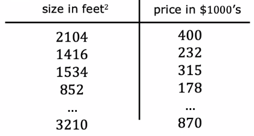
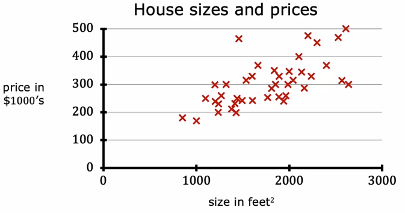
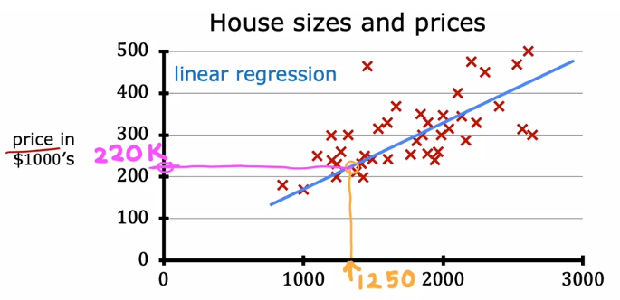
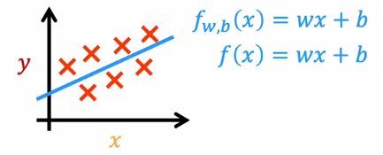

# Linear Regression Model

This model intuitively consists about crossing a line across the dates of the training set.
That line is carefully selected to be the best approach to all the data, so it can give the best possible predictions.
Also, as their name says, this model solves regression problems, i.e. problems with infinitely possible outputs.

### Example

Think about a model that can predict the price of a house.
Then we can have a training set given by data like this:

That if we plot in a Cartesian plane, give us the next points.

Is easy to see that this points can be approached by drawing a line through them.

So once we train the model with our data set we can predict, for example, that a house with 1250 square ft, can be sold by $220k.

## Model structure

The goal of this model is to obtain a function $f_{w,b}$ that uses a hyperplane to approximate our train data. This function will have the form

$$f_{w,b} = wx+b$$

Sometimes our data set can be better estimated by some other kind of functions, like polynomials, periodic functions ($sin$ or $cos$), among others; however for learning purposes, a hyperplane will fit our intentions.

Also, we will call "univariate" linear regression to a linear regression with a single feature.
